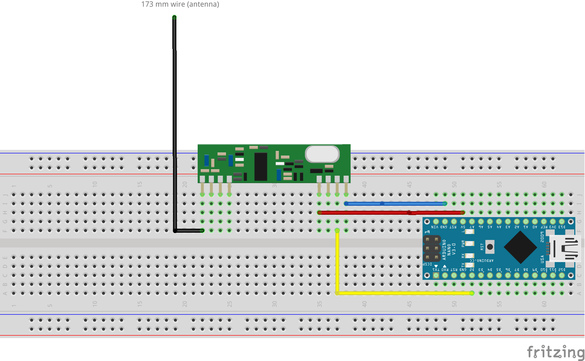

# Oregon Scientific sensor logger

An Arduino sketch to gather temperature and humidy from old Oregon Scientific sensor.

These sensors use the [Manchester code](https://en.wikipedia.org/wiki/Manchester_code) to send data to a weather station. This code was and still is widely used.

## Parts
- Arduino [Nano](https://store.arduino.cc/arduino-nano) or [Uno](https://store.arduino.cc/arduino-uno-rev3), or any other cheap clone
- 433Mhz receiver like this one [Amazon](https://www.amazon.fr/WINGONEER-433Mhz-Superheterodyne-récepteur-Arduino/dp/B06XHJMC82) [AliExpress](https://fr.aliexpress.com/item/NEW-RXB6-433Mhz-Superheterodyne-Wireless-Receiver-Module-for-Arduino-ARM-AVR/32808930551.html) (RXB6 superheterodyne)

## Library and software
- [Arduino-Oregon-Library](https://github.com/Mickaelh51/Arduino-Oregon-Library) : library used to decode the radio signal
- [PlatformIO](https://platformio.org) or [Arduino IDE](https://www.arduino.cc/en/main/software)
- [Fritzing part](http://forum.fritzing.org/t/diode-keine-led-bauform-0805-gesucht/2216/34) for the RXB6 module

## Sensors and messages

 * Oregon RTGR328N
    - 0x*ACC	Outside Temp-Hygro
    - 0x*AEC	Date & Time
    - 0x*AEA	Date & Time
* Oregon THGR228N
    - 0x1A2D	Outside Temp-Hygro

See [analyze.cpp](analyze.cpp) for details.

## Wiring

## Links

* [RFLink](http://www.rflink.nl/blog2/) closed source gateway
* [RFLink](https://github.com/cwesystems/RFLink) fork of rflink when it was open source (there are may other forks on GitHub).
* [Oregon Scientific RF Protocol Description](http://wmrx00.sourceforge.net/Arduino/OregonScientific-RF-Protocols.pdf) :
* [Decoding the Oregon Scientific V2 protocol](https://jeelabs.net/projects/cafe/wiki/Decoding_the_Oregon_Scientific_V2_protocol)
* and so on (use google)
